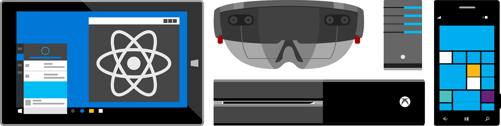

# React Native plugin for Universal Windows Platform (UWP)



[React Native](http://facebook.github.io/react-native) enables you to build world-class application experiences on native platforms using a consistent developer experience based on JavaScript and [React](http://facebook.github.io/react). The focus of React Native is on developer efficiency across all the platforms you care about - learn once, write anywhere. Facebook uses React Native in multiple production apps and will continue investing in React Native.

This repository adds support for the [Windows 10 SDK](https://developer.microsoft.com/en-us/windows/downloads), which allows you to build apps for:
* Windows 10
* Windows 10 Mobile
* [Xbox One (UWP)](https://msdn.microsoft.com/en-us/windows/uwp/xbox-apps/index)

## Quick Links

- [Getting Started](#getting-started)
- [Getting Help](#getting-help)
- [Documentation](#documentation)
- [Examples](#examples)
- [Extending React Native](#extending-react-native)
- [Code of Conduct](CODE_OF_CONDUCT.md)
- [Opening Issues](#opening-issues)
- [Contributing](#contributing)
- [License](#license)

## Introduction

See the official [React Native website](https://facebook.github.io/react-native/) for an introduction to React Native.

## Getting Started

- Follow the [Getting Started guide](http://facebook.github.io/react-native/docs/getting-started.html) to install React Native and its dependencies.
- Install [rnpm-plugin-windows](https://www.npmjs.com/package/rnpm-plugin-windows) from NPM (i.e., `npm install --save-dev rnpm-plugin-windows`).
- Initialize Windows project with `rnpm windows` command (with `rnpm` installed globally).
- Learn more about various [tools for debugging React Native](http://facebook.github.io/react-native/docs/debugging.html).

### Requirements

In addition to the requirements from the [Getting Started guide](http://facebook.github.io/react-native/docs/getting-started.html):
- [Visual Studio 2015 Community](https://msdn.microsoft.com/en-us/library/dd831853.aspx)
- [Windows 10 SDK Build 10586](https://developer.microsoft.com/en-US/windows/downloads/windows-10-sdk)

If this is your first time using UWP, you may be able to install the SDK by opening the [solution file](ReactWindows/ReactNative.sln) in the ReactWindows folder in Visual Studio. After opening the solution, right click the Solution in the Solution Explorer and select the option labeled "Install Missing Components". You may have to shutdown Visual Studio to continue the installation.

## Getting Help

Please use these community resources for getting help. We use the GitHub issues for tracking bugs and feature requests and have limited bandwidth to address them.

- Chat with us on [Reactiflux](https://discord.gg/0ZcbPKXt5bWJVmUY) in #react-native-platforms
- If it turns out that you may have found a bug, please [open an issue](#opening-issues)

## Documentation

[React Native already has great documentation](http://facebook.github.io/react-native/docs), and we're working to ensure the React Native Windows plugin is part of that documentation story. Check out the [React documentation](http://facebook.github.io/react/) for further details about the React API in general.

For information on parity status with Android and iOS, including details on implemented and missing components and modules, along with related issues for missing features from partial implementations, go [here](docs/CoreParityStatus.md).
## Examples

```
git clone --recursive https://github.com/ReactWindows/react-native-windows.git
cd react-native-windows
npm install
```

### Running the examples

- Start the React Native packager by running `react-native start` 
- Open Examples.sln from the Examples submodule folder in Visual Studio.
- Set the StartUp project to the example you want to run, press F5.

## Extending React Native

- Looking for a component? [JS.coach](https://js.coach/react-native)
- Fellow developers write and publish React Native modules to npm and open source them on GitHub.
- Many third party modules may be missing Windows support, so reach out to the project owners directly.
- Making modules helps grow the React Native ecosystem and community. We recommend writing modules for your use cases and sharing them on npm.
- Read the guides on [Native Modules for Windows](docs/NativeModulesWindows.md) **(Coming Soon)** and [Native UI Components for Windows](docs/NativeComponentsWindows.md) **(Coming Soon)** if you are interested in extending native functionality.

## Opening Issues

If you encounter a bug with the React Native Windows plugin, we would like to hear about it. Search the [existing issues](https://github.com/ReactWindows/react-native-windows/issues) and try to make sure your problem doesn’t already exist before opening a new issue. It’s helpful if you include the version of React Native, React Native Windows plugin, and device family (i.e., mobile, desktop, Xbox, etc.) you’re using. Please include a stack trace and reduced repro case when appropriate, too.

The GitHub issues are intended for bug reports and feature requests. For help and questions with using the React Native Windows plugin please make use of the resources listed in the [Getting Help](#getting-help) section. There are limited resources available for handling issues and by keeping the list of open issues lean we can respond in a timely manner.

## FAQs

1. Running `rnpm windows` fails with `No compatible version found: react-native-windows@0.x.*`

We try to keep up-to-date with the latest version of `react-native`, but sometimes we fall a bit behind. The default behavior of the Windows init RNPM plugin is to try and install the version of `react-native-windows` that matches the version of `react-native` that you're using (from the `package.json` file of your project).  Often times, an older version of `react-native-windows` will work just fine with a later version of `react-native`, so a good first attempt is to try and select the latest (or release candidate) version of `react-native-windows` using the `--windowsVersion` flag.  E.g.,

```
rnpm windows --windowsVersion 0.x.0-rc.0
```

Where `x` is the version of `react-native` you have installed.

## Contributing

For more information about contributing PRs and issues, see our [Contribution Guidelines](https://github.com/ReactWindows/react-native-windows/blob/master/CONTRIBUTING.md) **(Coming Soon)**.

[Good First Task](https://github.com/ReactWindows/react-native-windows/labels/Good%20First%20Task) and [help wanted](https://github.com/ReactWindows/react-native-windows/labels/help%20wanted) are great starting points for PRs.

We're still working on our CI story. In the meantime, please be sure to run the unit tests in Visual Studio before submitting pull requests.

## License

The React Native Windows plugin is provided under the [MIT License](LICENSE).
