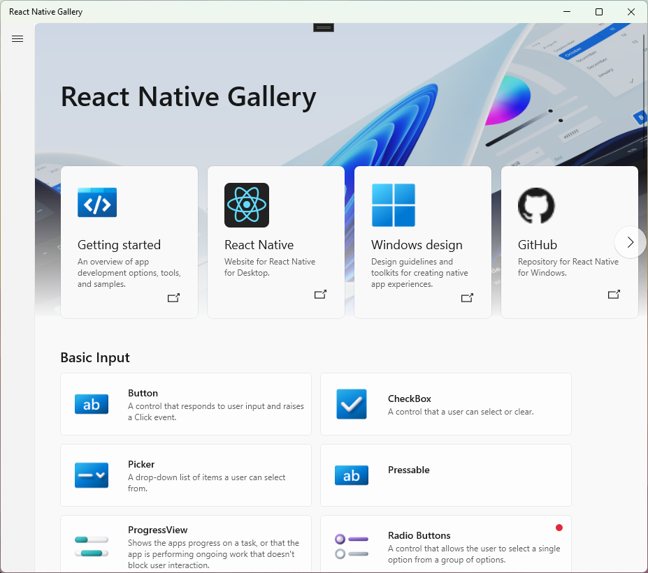
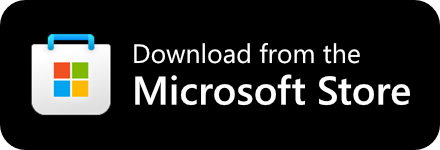

<h1 align="center"> React Native for Windows </h1>

  

<h3 align="center">
  <a href="https://microsoft.github.io/react-native-windows">Website</a>
   · 
  <a href="https://microsoft.github.io/react-native-windows/docs/getting-started">Documentation</a>
   · 
  <a href="https://github.com/microsoft/react-native-windows/releases">Release notes</a>
</h3>

> See the official [React Native website](https://reactnative.dev/) for an introduction to React Native.

[React Native](https://reactnative.dev) is a framework developed by Meta that enables you to build world-class application experiences on native platforms using a consistent developer experience based on JavaScript and [React](https://reactjs.org/). The focus of React Native is on developer efficiency across all the platforms you care about - learn once, write anywhere.

This repository adds support for the [Windows 10 SDK](https://developer.microsoft.com/en-us/windows/downloads), which allows you to build apps for [all devices supported by Windows 10](https://developer.microsoft.com/en-us/windows/get-started-windows-10) including PCs, tablets, 2-in-1s, Xbox, Mixed reality devices etc.

Visit the official [React Native for Windows + macOS website](https://microsoft.github.io/react-native-windows) to learn more.

## 🛣️ Roadmap
[Check out our blog](https://microsoft.github.io/react-native-windows/blog/) if you'd like to stay up to date on the status of React Native for Windows and check out current and past roadmaps.

### New Architecture
[Fabric](https://reactnative.dev/architecture/fabric-renderer) is the new rendering system for React Native, designed to share more rendering logic cross-platform. RNW's existing Paper renderer is built on UWP XAML, dropping down into native Composition as need be; the new RNW Fabric renderer targets Composition from the start but has the ability to host islands of XAML for advanced native controls. Apps on the new architecture will be [WinAppSDK](https://learn.microsoft.com/en-us/windows/apps/windows-app-sdk/) Win32 by default. For more details on our roadmap to Fabric, check out [this pinned issue](https://github.com/microsoft/react-native-windows/issues/12042).

## 🖼️ React Native Gallery
Make sure to also check out the [React Native Gallery](https://github.com/microsoft/react-native-gallery), our interactive sample experience showing everything you can do with React Native for Windows.

 

## 📋 Getting Started
See the [Getting Started Guide](https://microsoft.github.io/react-native-windows/docs/getting-started) on our React Native for Windows + macOS website to build your first React Native for Windows app.

### Requirements
You can run React Native Windows apps only on devices supported by the [Windows 10 SDK](https://developer.microsoft.com/en-us/windows/downloads).

For a full and detailed list of the system requirements and how to set up your development platform, see our [System Requirements](https://microsoft.github.io/react-native-windows/docs/rnw-dependencies) documentation on our website.

### Logging Issues
Search the [existing issues](https://github.com/microsoft/react-native-windows/issues) and try to make sure your problem doesn’t already exist before opening a new issue. If your issue doesn't exist yet, provide as much information as possible so we can better help you. Include the information requested by the [appropriate issue template](https://github.com/microsoft/react-native-windows/issues/new/choose).

## Documentation
React Native has [great documentation](https://reactnative.dev/docs/getting-started). React Native for Windows adds its own separate [Windows and macOS documentation](https://microsoft.github.io/react-native-windows/) for desktop platform information like API docs and blog updates.

### Examples
- Using the CLI in the [Getting Started](https://microsoft.github.io/react-native-windows/docs/getting-started) guide will set you up with a sample React Native for Windows app that you can begin editing right away.
- Check the [samples repo](https://github.com/microsoft/react-native-windows-samples) for more standalone samples.
- The [React Native Gallery](https://github.com/microsoft/react-native-gallery) app demonstrates various components in an interactive way.
- Check out the [React Native Developer Blog](https://devblogs.microsoft.com/react-native/) to see examples from past conference talks, blog posts, and more.
- For more sample code browse the [RNTester folder](https://github.com/microsoft/react-native-windows/tree/main/packages/e2e-test-app/windows/RNTesterApp) in the GitHub web UI.

## 📢 Contributing
See [Contributing guidelines](https://github.com/microsoft/react-native-windows/blob/main/CONTRIBUTING.md) for how to setup your fork of the repo and start a PR to contribute to React Native for Windows.

Not sure where to start? The [good first issue](https://github.com/microsoft/react-native-windows/issues?q=is%3Aissue%20state%3Aopen%20label%3A%22good%20first%20issue%22) and [help wanted](https://github.com/microsoft/react-native-windows/issues?q=is%3Aissue%20state%3Aopen%20label%3A%22help%20wanted%22) labels are the best starting points.

## Code of Conduct
This project has adopted the [Microsoft Open Source Code of Conduct](https://opensource.microsoft.com/codeofconduct/). For more information see the [Code of Conduct FAQ](https://opensource.microsoft.com/codeofconduct/faq/) or contact [opencode@microsoft.com](mailto:opencode@microsoft.com) with any additional questions or comments.
