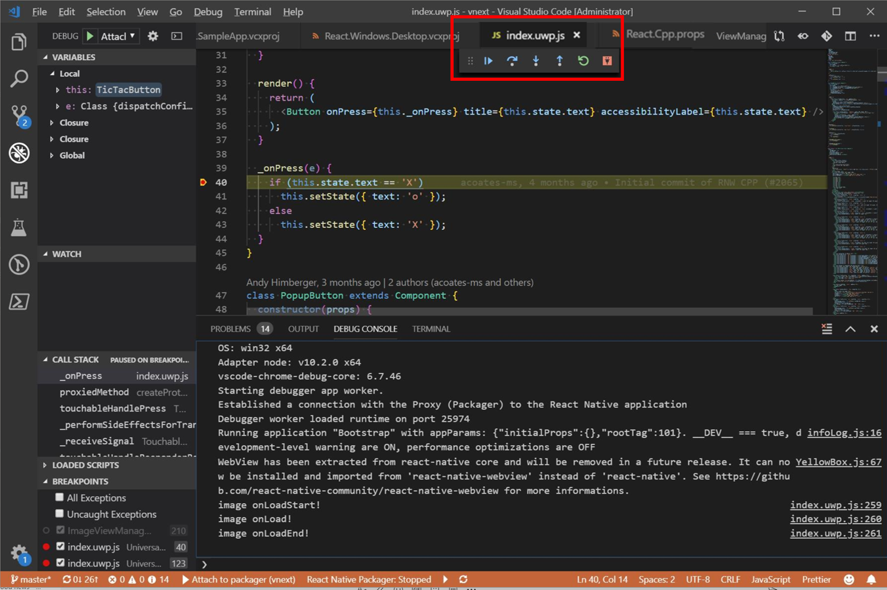

# July 2019 Updates

Over the past couple of months and spread across several contributors from Microsoft, we have completed [Milestone 2](https://github.com/microsoft/react-native-windows/milestone/16) for React Native for Windows. This blog post covers the highlights of the release. 

## Upgrade to support RN version 0.59

Both the `current` and `vnext` implementations of `react-native-windows` have been upgraded to support [React Native version 0.59](https://facebook.github.io/react-native/blog/2019/03/12/releasing-react-native-059). With this, you should be able to use the [React Hooks](https://reactjs.org/docs/hooks-intro.html) and all other goodness from the RN v0.59 update while targeting React Native for Windows. 

   *__Note__: You will need to explicitly specify the RN version number while initializing your project using the CLI to target React Native for Windows vnext like so*:
   ```
   react-native init <project name> --version 0.59.10
   ```
   Read the updated [Getting Started Guide for vNext](https://github.com/microsoft/react-native-windows/blob/master/vnext/docs/GettingStarted.md) for more details.


## Updates to parity in high priority APIs

We are making steady progress in achieving parity of implementation of React Native APIs in alignment with the React Native [Lean Core effort](https://github.com/facebook/react-native/issues/23313). As part of Milestone 2 - we have completed implementations of all the P1 (must-have) APIs on lean core components such as `Text`, `TextInput`, `View`, `Image`, `ScrollView`, `FlatList` and `Switch` as well as modules such as `Accessibility`, `LayoutProps`, smooth animations using native drivers, animated transforms etc., 

   

We are making steady progress in this workstream and will be investing more in [Milestone 3](https://github.com/microsoft/react-native-windows/milestone/17) with a goal to get to complete feature parity on lean-core components before EOY 2019. You can keep track of the progress here through the [Core Feature Parity project](https://github.com/microsoft/react-native-windows/projects/7) and [Parity Status doc](https://github.com/microsoft/react-native-windows/blob/master/vnext/docs/ParityStatus.md). We will also be working towards moving non lean-core components into a separate package in the upcoming months. 

## NEW Features!

We have introduced several new features, including:
   1. Keyboarding APIs to enable keyboard and gamepad invocation scenarios with good default behaviors for JS components like `Button`. See [Proposal draft](https://github.com/ReactWindows/discussions-and-proposals/blob/harinikmsft-keyboardapis/proposals/0000-keyboard-apis.md) for more details. 
   
   *Example usage:*

   ```
   <View onKeyDown={this._onKeyDown} />
   
   private _onKeyDown = (event: IKeyboardEvent) => {
      this.setState({ lastKeyDown: event.nativeEvent.key });
   };
  
   ```

   2. New APIs for handling theming and high contrast scenarios through styles. See [Proposal comment](https://github.com/react-native-community/discussions-and-proposals/issues/126#issuecomment-500561803) for details.

   *Example usage:*

   ```
   componentDidMount() {
     AppThemeState.currentTheme.addListener('themechanged', this.onAppThemeChanged);
   }

   onAppThemeChanged = (event) => {
     /*Logic on theme changed goes here*/
     this.setState({appThemeState: AppThemeState.currentTheme});
   }

   /* In render function */
   <TextInput
      style={[styles.inputStyle, this.state.appThemeState.currentTheme == 'dark' ? styles.darkInput : styles.lightInput]}
   </TextInput>
   ```

   3. New APIs for better accessibility in lists. See [Proposal](https://github.com/react-native-community/discussions-and-proposals/pull/146) for detailed documentation. 

   *Example usage:*

   ```
   <FlatList data={this.state.listdata} 
    accessibilityRole="list"
    renderItem={({item}) =>
     <View accessibilityRole="listItem" 
           accessibilitySetSize ={this.state.listdata.count}
           accessibilityPostInSet={item.id} >
        <Text>{item.name}</Text>
     </View>}
   </FlatList>
   ```

 
This marks the beginning of a journey where we actively will be contributing back to React Native and the wider community as almost all these APIs have been designed to be platform neutral/aligned with React programming model with a view to enhance the overall React Native API story for desktop and other targets. You can read about our proposals process [here](https://github.com/microsoft/react-native-windows/tree/master/vnext/proposals). 

We are working on better documentation and samples for these new updates, stay tuned!

## Onboarding and developer experience

We have been steadily addressing onboarding issues with the CLI, VS 2019 toolchain etc., to ensure reliability of your development experience. Thank you to those who have spun the wheels on this project so far and filed issues, please continue to report issues as you see them. 

We are also happy to report that we have begun a collaboration with VS Code for adding [React Native extension](https://marketplace.visualstudio.com/items?itemName=msjsdiag.vscode-react-native) support for React Native Windows. Through this extension, you will be able to debug your JS directly in VS Code without needing the Chrome debugger and several other useful tooling (including intellisense). We are in the early stages here, but since the work is happening in OSS, you can start trying this out using [these instructions](https://github.com/microsoft/react-native-windows/wiki/VS-Code-Debugging).

   


## Coming up next

We are tracking the next set of work for React Native for Windows through [Milestone 3](https://github.com/microsoft/react-native-windows/milestone/17) targeting a Fall 2019 ETA. The broad themes for Milestone 3 are:

   - Upgrade to RN v0.60
   - Complete feature parity for all “lean-core” RN APIs 
	- Native extensions developer story
	- More new features around mouse hover, styling JS components, custom tab navigation, directional focus etc., 
	- Improved developer experience, documentation and onboarding reliability
	- Strategic performance investments and test infrastructure bring up
   - React-Native-Windows targeting [WinUI 3.0](https://github.com/microsoft/microsoft-ui-xaml/blob/master/docs/roadmap.md#winui-3-q4-2019---2020). 

Please see the [Roadmap 2019](blog/Roadmap2019.md) blog for more details. 