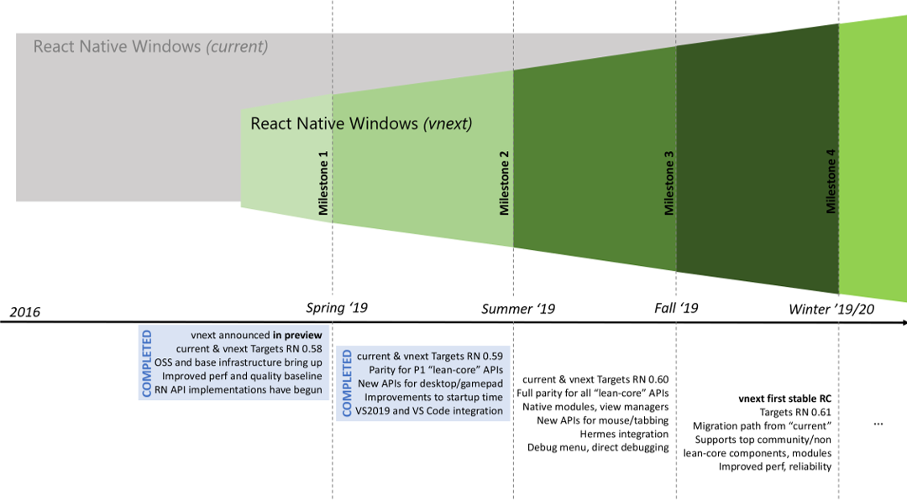

# React Native for Windows Roadmap (2019 through early 2020)

This document outlines some context and prospective roadmap for React Native for Windows. This project is under active development by the Microsoft Developer Platform team in collaboration with Office, Xbox and other partners as well as the wider React Native community. This roadmap is not meant to be exhaustive or guaranteed since we are also keeping up with the evolving [facebook\react-native](http://facebook.github.io/react-native/) project and the needs of the React Native community. 

This repo contains 2 parallel implementations of React Native for Windows:

## current
The ["current"](https://github.com/microsoft/react-native-windows/tree/master/current) subdirectory holds an earlier C# implementation for `react-native-windows` that has existed since 2016. This architecture is strictly in maintenance mode and investments here are limited to upgrading of versions to support latest react-native versions and addressing any blocking issues/bugs to make sure existing customers of this implementation can upgrade their apps.

Please continue to report issues as you encounter them, but be sure to use the [correct template](https://github.com/microsoft/react-native-windows/issues/new?assignees=rozele&labels=.NET&template=DOTNET.md) for issues related to the existing `react-native-windows` package.

## vnext
The ["vnext"](https://github.com/microsoft/react-native-windows/tree/master/vnext) subdirectory holds the newer, high performance implementation for `react-native-windows` written in C++ to better align with the shared C++ react-native core as it evolves. This is the new architecture where all the ongoing feature investments are being made at this time. You can read more about this effort [here](/vnext/README.md). 

Our intent is to provide a compatibility layer for vnext that will support existing apps, view managers, and native modules written in C# with minimal breaking changes.

We are tracking progress across several workstreams on this vnext effort through [Projects](https://github.com/microsoft/react-native-windows/projects), [Issues](https://github.com/microsoft/react-native-windows/issues?q=is%3Aopen+is%3Aissue+label%3Avnext) and [Milestones](https://github.com/microsoft/react-native-windows/milestones). 

The below picture captures the high level roadmap for investments through 2019 and into early 2020. 

