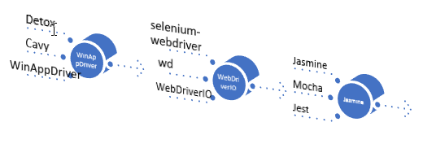
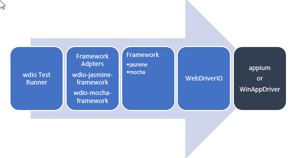
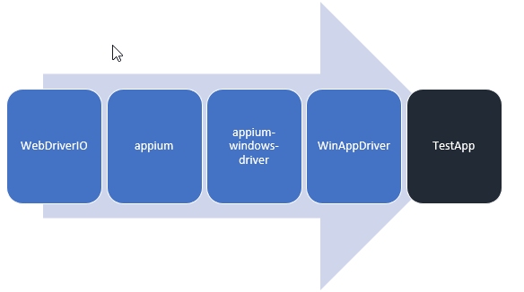
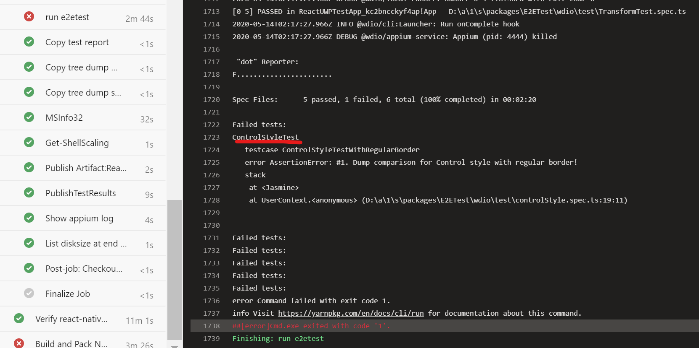
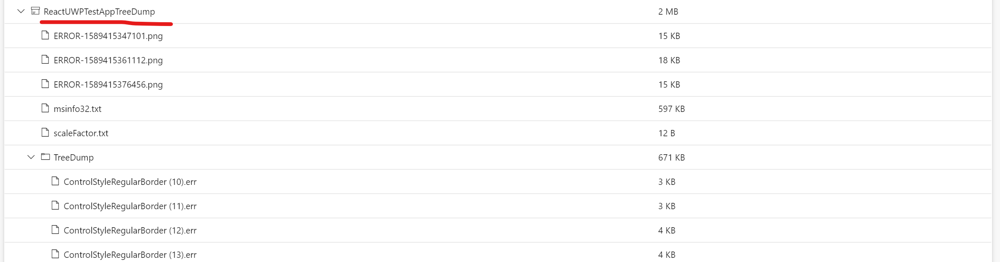
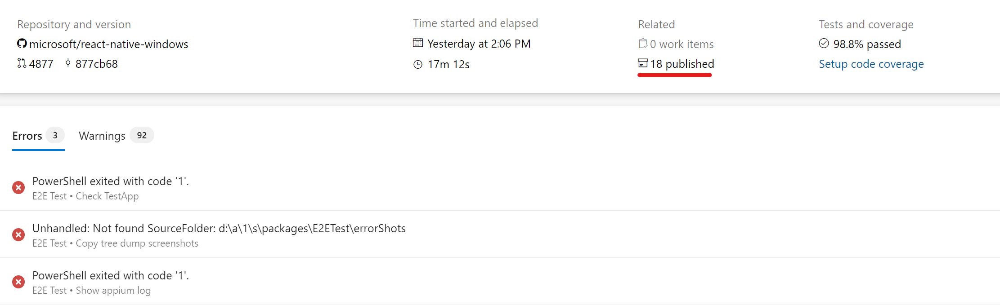
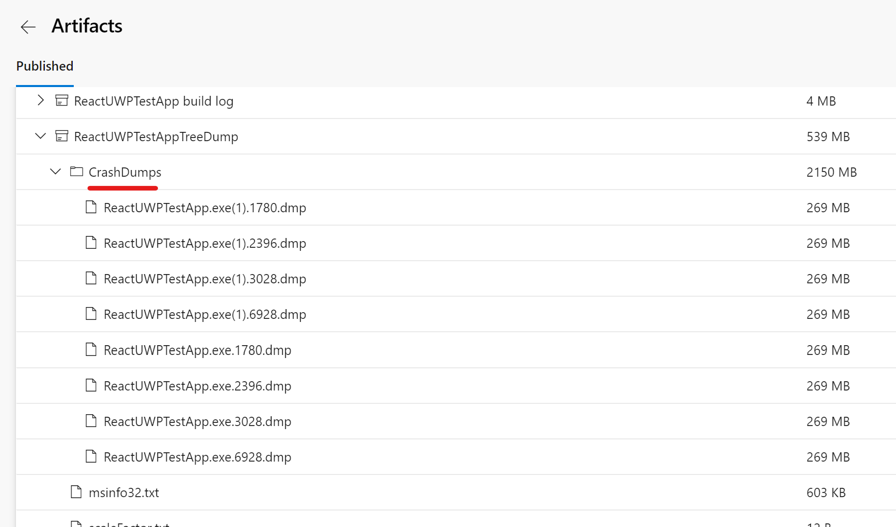
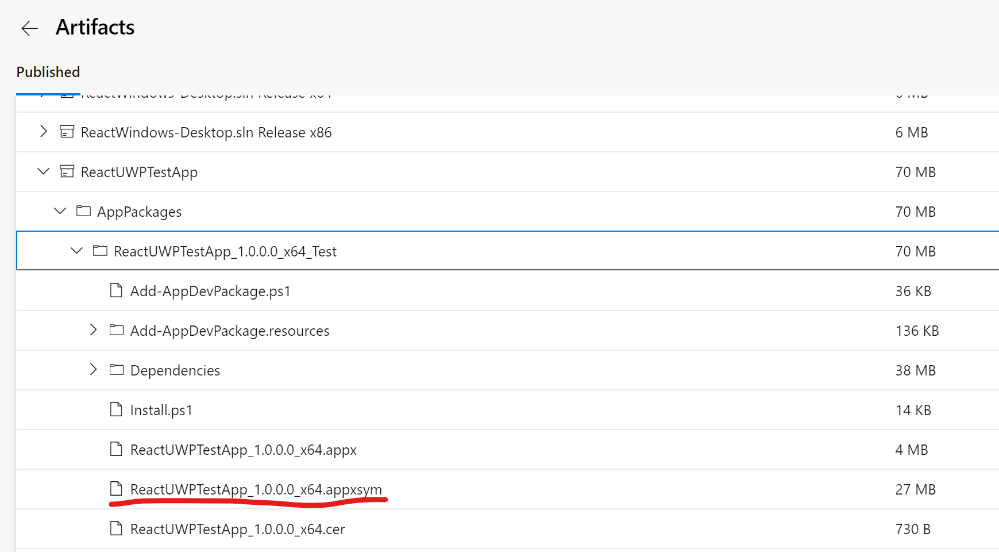

# Author and Run E2E Test for React Native Windows

## E2E project structure

E2E test app, test library and test cases are in packages/E2ETest/, and they are organized as below.

 - app – the RN app folder
 - reports – save the test reports
 - wdio – includes the page object libraries and test cases.
 - windows – the UWP native app
 - wdio.config.js – default parameters used by wdio test runner

# Run E2E test

- Make sure you have installed [dependencies](https://microsoft.github.io/react-native-windows/docs/rnw-dependencies)

## Procedures to setup and run E2E test

### Download and install WinAppDriver [WinAppDriver v1.1](https://github.com/microsoft/WinAppDriver/releases/download/v1.1/WindowsApplicationDriver.msi)

### Install node packages, build JS

- C:\repo>`cd react-native-windows`
- C:\repo\react-native-windows>`yarn install`
- C:\repo\react-native-windows>`yarn build`

### Start the Metro server

- C:\repo\react-native-windows>`cd packages\E2ETest`
- C:\repo\react-native-windows\packages\E2ETest>`yarn run start`

### To build, deploy and run the full e2e test suite

- C:\repo\react-native-windows>`cd packages\E2ETest`
- C:\repo\react-native-windows\packages\E2ETest>`yarn run e2e`

### To run E2E tests

First make sure bundle server is running (see "Start the Metro server" above)

- To run all test specs

packages\E2ETest>`yarn run e2etest`

-  To run one test spec (eg login.spec.ts)

packages\E2ETest>`yarn run testspec wdio\test\login.spec.ts`

## Commands help with build and test

| Command | Description | Example |
| --- | --- | --- |
| test | Run all specs | `yarn run e2etest` |
| testspec | Run only one spec | `yarn run testspec wdio\test\login.spec.ts` |
| buildapp | build the native app with BUNDLE macro <BR/> `--release` specify if it's a release version <BR/>`--arch [string]` The build architecture (ARM, x86, x64) (default: &quot;x86&quot;) | `yarn run buildapp` <BR/> `yarn run buildapp --release` <BR/>`yarn run buildapp --arch x64` <BR/> `yarn run buildapp --arch x64 –release` |
| deployapp | Deploy the built test app, you can pair it with `--release` and `--arch` | `yarn run deployapp` <BR/> `yarn run deployapp --release` <BR/> `yarn run deployapp --arch x64` <BR/> `yarn run deployapp --arch x64 –release` |
| e2e | Build and deploy the solution (x86, debug), launch metro bundler and run all e2e specs | `yarn run e2e` |
| start | Launch the metro bundler | `yarn run start` |
| react-native run-windows | For details, see: react-native run-windows --help | `react-native run-windows --no-launch --no-packager --no-deploy --bundle` |

# Authoring E2E Test

## Create a new page for the test app

New test page should be in E2E/app/ or its subfolder.

Hooks are recommended to author the test page. (see [https://reactjs.org/docs/hooks-intro.html](https://reactjs.org/docs/hooks-intro.html) and this [Pluralsight course](https://app.pluralsight.com/library/courses/using-react-hooks) to learn more about Hooks)

```
// LoginTestPage.ts
export function LoginTestPage() {
  const [loginState, setLoginState] = useState('');
  …
  return (
    <View>
      <TextInput style={styles.input}
        placeholder='Email or Mobile Num'
        placeholderTextColor='rgba(225,225,225,0.7)'
        testID="login-field"
        onChange={(text) => { setUserName(text.nativeEvent.text) }} />
   	…
 </View >);
}

```

## Add the new page to RNTesterList.windows.ts

```
  {
    key: 'LegacyAccessibilityTest',
    module: require('react-native/RNTester/js/examples-win/LegacyTests/AccessibilityTestPage'),
  },
```

## Write a test spec to use the Page Object

```ts
// login.test.ts

describe('LoginTest', () => {

  beforeAll(async () => {
    await goToComponentExample('LegacyAccessibilityTest');
  });

  it('Login Success', () => {
    const loginForm = await $('~login-field');
    await loginForm.setValue('username');
    ...
  });

});

```

# Restrictions

1. If you made any change to native code, you must rebuild the native app and redeploy it.
2. The same session can&#39;t be shared by multiple specs. The framework always kills the old app and launches a new session.

# Known issue

1. For `yarn run e2e` or `yarn run e2ebundle`, the test continues even if one of steps like build failed. see [bug 3136](https://github.com/microsoft/react-native-windows/issues/3136) for more details

# Debugging jasmine tests
To debug in VS Code, create a configuration in your launch.json that looks like this:
```
{
    "version": "0.2.0",
    "configurations": [
        {
            "type": "node",
            "request": "launch",
            "name": "run wdio",
            "program": "${workspaceRoot}/run_wdio.js",
             "args": ["controlStyle"],
            "stopOnEntry": true,
            "autoAttachChildProcesses": true        
        },
    ]
}
```
If you want to run all the tests, omit args.  If you want it to run just one test, supply just the name of the test spec without the spec.ts extension as an arg.  

jasmine runs in a child node process, so the "autoAttachChildProcesses" : true is required for VS Code to attach to that child process.  With that setup, you can now set breakpoints in your test specs and VS Code will let you debug your tests.

# More about E2E test

## Technical Decisions

### MSTest vs node test runner

A `node` test runner is the first choice since we started the investigation for E2E test. React Native apps are written in JavaScript and it&#39;s a good choose to select a JavaScript framework to author the test case. It would be more friendly to the community, so MSTest with C# is excluded in our option.

### Appium
[Appium](http://appium.io/) is a W3C-standards based technology based on Selenium, a popular test technology for the web.  Appium supports Windows as well as Android, iOS, and MacOS.
Because WinAppDriver implements part of W3C-standards, appium is an optional component in Windows.

Note: Appium is finally removed from RNW project in [PR 6636](https://github.com/microsoft/react-native-windows/pull/6636). So wdio communicates with WinAppDriver directly. Instead of Appium service, [WinAppDriver service](https://github.com/licanhua/wdio-winappdriver-service) is used to launch and stop WinAppDriver during the testing.


### WinAppDriver + WebDriverIO + Jasmine
There is not existing example we can follow to setup E2E testing on Windows for React Native, and I spent weeks to investigate, test and prototype for our E2E. Hereafter I explain what kind of decisions I made and why I made these decisions



#### Why WinAppDriver

1. Detox or Cavy require a significant, ongoing investment from us.
2. WinAppDriver is owned by us.

#### Why WebDriverIO

1. Be released more frequently.
2. [wdio-sync](https://github.com/webdriverio/webdriverio/tree/master/packages/wdio-sync) makes you write test case without using await.
3. wdio test runner makes the integration as quickly as possible.

Personally, I think WebDriverIO also introduced some difficulties:

1. Don&#39;t support Jest.
2. Another set of APIs different from selenium community.
3. wdio test runner simplified the steps for user to do the integration, but it also complexed the system. It have a lot of processes which makes debugging very hard.

#### Why Jasmine

1. wdio doesn&#39;t support Jest.
2. Mocha is used in my prototype, but it doesn&#39;t report test failure if exception is thrown in &#39;before&#39; function.
3. It&#39;s a piece of cake to switch from Mocha to Jasmine, and I finished this job in 10 minutes. See PR [3197](https://github.com/microsoft/react-native-windows/pull/3107)

## wdio Test Runner

WebdriverIO comes with its own test runner @wdio/cli. It simplified the steps for the integration, but it make it hard to be understood and be troubleshooted.

Below chart explains how different libraries are linked together when wdio command is launched. Appium or WinAppDriver are running in separate processes, and WebDriverIo talks to them by [W3C WebDriver protocol](https://w3c.github.io/webdriver/).


## WinAppDriver

WinAppDriver talks to TestApp by [UIA](https://docs.microsoft.com/en-us/windows/uwp/design/accessibility/accessibility-testing), and WinAppDriver implements part the W3C WebDriver protocol which allows WebDriver to talk to him. So WinAppDriver could talk directly with WebDriverIO, and whole test framework could be either with or without Appium.

There are two possible setup in dev environment based on with/without appium:
- Option 1

- Option 2


Because of project [wdio-winappdriver-service](https://github.com/licanhua/wdio-winappdriver-service), option 2 is recommended and implemented in RNW e2e testing. 

If `yarn install` is run as admin privilege, WinAppDriver would be installed automatically, otherwise you need to install WinAppDriver manually.

For the Azure pipeline, WinAppDriver is already installed on  [HostedVS2019](https://github.com/actions/virtual-environments/blob/master/images/win/Windows2019-Readme.md) and [HostedVS2017](https://github.com/actions/virtual-environments/blob/master/images/win/Windows2016-Readme.md)


## Bundle
Generally speaking, you don't need to care about it until you  setup Azure pipeline, or the app is ready for production.

In E2E project, bundle has two meanings:

1. Just like `react-native bundle` helps to generate an offline bundle file, then the app can run without the Metro Bundler.
2. A macro to build the native project. ReactUWPTestApp provides six bundle configurations: ReleaseBundle|x86, ReleaseBundle|x64, ReleaseBundle|ARM, DebugBundle|x86, DebugBundle|x64, DebugBundle|ARM

`Bundle` is very close to the production enviroment.
Here are commands to support `Bundle` in the E2E test:

| Command | Description | Example |
| --- | --- | --- |
| bundle | Create a bundle file which then be packaged to the native app | yarn run bundle |
| buildbundleapp | build the native app with BUNDLE macro. <BR/> `--release` specify if it's a release version. <BR/> `--arch [string]` The build architecture (ARM, x86, x64) (default: &quot;x86&quot;) | `yarn run buildbundleapp` <BR/> `yarn run buildbundleapp --release` <BR/> `yarn run buildbundleapp --arch x64` |
| deploybundleapp | Deploy the built test app, you can pair it with `--release` and `--arch` | `yarn run deploybundleapp` <BR/>  `yarn run deploybundleapp --release` <BR/>  `yarn run deploybundleapp --arch x64` |
| e2ebundle | Make a bundle, Build and deploy the solution, and run the testing | `Yarn run e2ebundle` |

## Locators to find UI Element

No matter what JavaScript framework you choose for native app testing, you have to use one of the locators which is described in [mobile JSON wire protocol](https://github.com/SeleniumHQ/mobile-spec/blob/master/spec-draft.md#locator-strategies). Since locators are implemented significant different on iOS, Android and Windows, as below I only talk about the locators for Windows.

### [Locators WinAppDriver supports](https://github.com/microsoft/WinAppDriver/blob/master/Docs/AuthoringTestScripts.md#supported-locators-to-find-ui-elements)

 WinAppDriver provides rich API to help locate the UI element. If [testID](https://facebook.github.io/react-native/docs/picker-item#testid) is specified in React Native app for Windows, the locator strategy should choose `accessibility id`.

A unique `accessiblity id`/`testID` per Window is recommended for React Native Windows E2E testing when authoring the test app and test cases. To ease the maintain effort, all testIDs are defined in [VisitAllPages.test.ts](https://github.com/microsoft/react-native-windows/blob/master/packages/E2ETest/wdio/test/VisitAllPages.test.ts), then be imported by test app and test page objects or test cases.

| **Client API** | **Locator Strategy** | **Matched Attribute in inspect.exe** | **Example** |
| --- | --- | --- | --- |
| FindElementByAccessibilityId | accessibility id | AutomationId | AppNameTitle |
| FindElementByClassName | class name | ClassName | TextBlock |
| FindElementById | Id | RuntimeId (decimal) | 42.333896.3.1 |
| FindElementByName | Name | Name | Calculator |
| FindElementByTagName | tag name | LocalizedControlType (upper camel case) | Text |
| FindElementByXPath | Xpath | Any | //Button[0] |

### [Locators WebDriverIO supports](https://webdriver.io/docs/selectors.html#mobile-selectors)

| **Client API by Example** | **Locator Strategy** |
| --- | --- |
| $(&#39;~AppNameTitle&#39;) | accessibility id |
| $(&#39;TextBlock&#39;) | class name |

## Timers

1. wdio.conf.js (see [https://webdriver.io/docs/timeouts.html](https://webdriver.io/docs/timeouts.html) )

```
// Default timeout for all waitFor\* commands.
waitforTimeout:10000,

jasmineNodeOpts: {
        defaultTimeoutInterval: 60000,
    }
```
2. Session Implicit Wait Timeout

A session has an associated session implicit wait timeout that specifies a time to wait for the implicit element location strategy when locating elements using the [findElement](https://webdriver.io/docs/api/webdriver.html#findelement) or [findElements](https://webdriver.io/docs/api/webdriver.html#findelements) commands. Unless stated otherwise it is zero milliseconds. You can set this timeout via:

```
browser.setTimeout({ 'implicit': 5000 });
```

3. waitForPageTimeout.

This timer is provided by BasePage object.

```
  // Default timeout for waitForPageLoaded command in PageObject
  privatewaitforPageTimeout: number = 10000;
```

You can override the setting in test case by passing a timeout parameter when call `waitForPageLoaded`, for example:

```
LoginPage.waitForPageLoaded(15000)
```

## wdio.conf.js

### Capabilities

the `capabilities` array is the set of configuration options that WinAppDriver uses to identify the app, and launch it. The below configuration options are supported when appium is not involved in the setup.
`ms:experimental-webdriver` is a mandatory setting to make WinAppDriver use the W3C protocol.
`ms:experimental-webdriver` is an mandatory setting to make WinAppDriver use W3C protocol.

```
  capabilities: [
  {
      maxInstances: 1,
      app: 'ReactUWPTestApp_cezq6h4ygq1hw!App',
      'ms:experimental-webdriver': true,
  },

```

### LogLevel
```
    logLevel: 'trace'
```
### Timeout

```
    // Default timeout for all waitFor* commands.
    waitforTimeout: 10000,
```

### winappdriver service

The below configuration lets the framework launch/terminate WinAppDriver automatically during testing, and logs are saved as `reports\winappdriver.txt`.

```
    port: 4723,
    services: ['winappdriver'],
    winappdriver: {
        logPath: './reports/',
    },

```
### Test framework
```
framework: 'jasmine'
```

### Reports

```
reporters: ['dot', ['junit', { outputDir : '.\\reports' }]],
```

## PageObject Pattern

PageObject Pattern is recommended in the E2E test, and you can get more information from these links:

[https://github.com/SeleniumHQ/selenium/wiki/PageObjects](https://github.com/SeleniumHQ/selenium/wiki/PageObjects)

[https://webdriver.io/docs/pageobjects.html](https://webdriver.io/docs/pageobjects.html)

## Element Locator `By`

```
private get submitButton() {
    return By('Submit');
}

this.submitButton.click();
```

You can easily to use By(string) to locate a element which associated with testID in the app.

It's recommended to define a `get` for each locator like above.

## E2E Tests and masters

E2E tests can be summarized as follows:
- they are tests that run the ReactUWPTestApp
- use UI Automation to navigate between pages, query the state of elements, click on them, etc.
- the ReactUWPTestApp has code to produce a dump of the its own visual tree ("tree dump output") and compares it with a checked in copy ("tree dump masters") to make sure nothing has regressed. The tree dumps are produced in Json format (there is also an option to produce them in a custom text format of key=value, but that is deprecated now).

So you've added or updated some tests: great! you get a cookie*. But now you probably need to update the masters, or the tests will fail and break the CI.

\* void where prohibited, prizes and participation may vary.



The best way to do this is by letting the CI run and fail, then downloading the generated tree dump output files, and comparing to the masters. Make sure the differences are expected, copy over them and check them in. The reason is that the masters will include things like the size elements rendered at, which can be dependent on DPI, scale factor, resolution, and in some cases (due to bugs) even differ based on bitness (see #4628).

When an output doesn't match its master, a file with `.err` extension will be produced under the `TreeDump` folder in the `ReactUWPTestAppTreeDump` artifact. The content of the `.err` file will usually just say:

```txt
Tree dump file does not match master at C:\Program Files\WindowsApps\ReactUWPTestApp_1.0.0.0_x64__cezq6h4ygq1hw\Assets\TreeDump\masters\ControlStyleRoundBorder.json - See output at C:\Users\VssAdministrator\Documents\ReactUWPTestApp_cezq6h4ygq1hw\LocalState\TreeDump\ControlStyleRoundBorder.json
```



Find the corresponding `.json` file in that folder and compare it to its master. The masters live in [e2etest\windows\ReactUWPTestApp\Assets\TreeDump\masters](https://github.com/microsoft/react-native-windows/tree/master/packages/E2ETest/windows/ReactUWPTestApp/Assets/TreeDump/masters).

Sometimes you'll have an element in your test that produces output that should not be used for comparison. You can manually edit the generated json and set the output that you want to ignore to the `<ANYTHING>` value:

```json
...
"Windows.UI.Xaml.Button":
{
  "Text": "<ANYTHING>",
  ...
}
...
```

## Debugging E2E Tests in CI
If you have access to the AzureDevOps pipeline you'll be able to see test failures and debug crashes.
Here are the artifacts that are produced during the build:
- error screenshots of the app when a test failed
- test run XML - this contains some information like the name of the wdio test that failed and the JS stack
- tree dump outputs - you can compare these to the masters to see if there is a the difference responsible for the test failing. 
- crash dumps of the e2e test app (ReactUWPTestApp)

You can access these by going to the AzureDevOps run for your PR and clicking on the artifacts link:



Then you can access crash dumps under the `ReactUWPTestAppTreeDump\CrashDumps` folder.


You can get the symbols from the `appxsym` (just download it and rename it to `.zip`):


 The `ReactUWPTestAppTreeDump` folder will also contain any tree dump outputs that were produced that did not match the masters.  
 
 ## Troubleshooting

 ### E2ETests fail when run locally after sync  

After doing a sync, E2E tests currently fail, see details in https://github.com/microsoft/react-native-windows/issues/5762  
The workaround is to do a yarn install --force, then re-run the tests.
