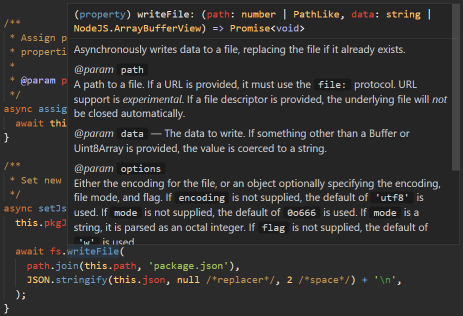

# @react-native-windows/fs

`@react-native-windows/fs` is a minimal-dependency drop-in replacement to `fs` with changes for
resiliency, promises, and convenience. It has several opinionated changes, targeted towards CLI
applications handling JavaScript-oriented files.



## Async Usage (Default)

`@react-native-windows/fs` exposes a Promise-based API, mostly matching that of `fs.promises`, with
several methods added [extra methods](#Extra-Methods).

```ts
// import {promises as fs} from 'fs'
import fs from '@react-native-windows/fs';

const fileContent = await fs.readFile('foo.txt');
```

## Sync Usage

`@react-native-windows/fs` exports all `fs.*Sync` Where an async version has a graceful
implementation, and the synchronous version does not, the method is marked as deprecated.

```ts
// import fs from 'fs'
import fs from '@react-native-windows/fs';

const fileContent = fs.readFileSync('foo.txt');
```

## Extra Methods

### `exists`
NodeJS deprecated `fs.exists`, and removed `fs.promises.exists`. The recommendation is to instead
acquire a lock to the file via `fs.open` for the duration of file-use. One-shot existence checks are
still useful, and because `fs.existsSync`is not deprecated, more likely means usage of blocking
synchronous APIs.

```ts
import fs from '@react-native-windows/fs';

const fooExists = await fs.exists('foo.txt');
```

### `readJsonFile` and `readJsonFileSync`

`@react-native-windows/fs` provides convenience methods to handle JSON files. The following methods
are added:

| Method | Return type |
|-|-|
| `readJsonFile<T>` | `Promise<T>` or `Promise<Record<string, unknown>>` |
| `readJsonFileSync<T>` | `T` or `Record<string, unknown>` |

```ts
import fs from '@react-native-windows/fs';

// foo is type: Record<string, unknown> by default
const foo = await fs.readJsonFile('foo.json');

// foo is type: FooProps
type FooProps = { name: string, version: string };
const foo = await fs.readJsonFile<FooProps>('foo.json');
```

## Resiliency

`@react-native-windows/fs` uses [`graceful-fs`](https://github.com/isaacs/node-graceful-fs) to
gracefully handle transient filesystem conditions, at the cost of extra latency. This includes
transient `EPERM`, `EACCESS`, `EMFILE`, `ENFILE`. This can be important when handling files that a
subject to antivirus, which may temporarily lock mutation of files on Windows.

## eslint
We reccomend adding the following rules to your eslint config if you would like to use
`@react-native-windows/fs` everywhere:
```js
module.exports = {
  rules: {
    'no-restricted-imports': [
      'error', {
        name: 'fs',
        message: 'Please use `@react-native-windows/fs` instead of `fs`'
      }
    ],
  }
}
```
