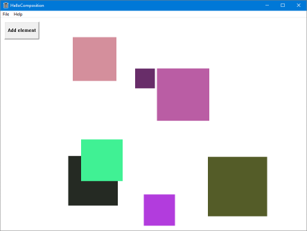

# Win32 HelloComposition sample

This sample contains the code created in the [Using the Visual Layer with Win32](https://docs.microsoft.com/windows/uwp/composition/using-the-visual-layer-with-win32) tutorial. It's a simple user interface (UI) that demonstrates how to add Universal Windows Platform (UWP) [Visual Layer](https://docs.microsoft.com/windows/uwp/composition/visual-layer) content to a C++ Win32 app.

The Visual Layer APIs provide a high performance, retained-mode API for graphics, effects, and animations. It's the recommended  replacement for DirectComposition in apps that run on Windows 10.

This sample demonstrates how to set up the interop code needed to use these APIs in a C++ Win32 app.

## Features

This sample includes the following features:

- A host class that implements interop between Win32 and UWP Composition APIs.
- Simple use of Composition visuals, brushes, and animations.

## Run the sample

This sample requires:

- Visual Studio 2022 or later - [Get a free copy of Visual Studio](http://go.microsoft.com/fwlink/?LinkID=280676)
- .NET Framework 4.7.2 or later
- Windows 10 version 1803 or later
- Windows 10 SDK 17134 or later

## Code at a glance

### CompositionHost

The main feature of this sample is the **CompositionHost** class, which contains the code to set up interop between Win32 and the UWP Visual Layer.

The CompositionHost class is written in [C++/WinRT](https://docs.microsoft.com/windows/uwp/cpp-and-winrt-apis/). For more info about using C++/WinRT with an existing C++ Win32 desktop app, see [Get started with C++/WinRT - Modify a Windows Desktop application project to add C++/WinRT support](https://docs.microsoft.com/windows/uwp/cpp-and-winrt-apis/get-started#modify-a-windows-desktop-application-project-to-add-cwinrt-support).

## See also

- [Visual Layer documentation](https://docs.microsoft.com/windows/uwp/composition/visual-layer)
- [Windows.UI.Composition](https://docs.microsoft.com/uwp/api/windows.ui.composition)