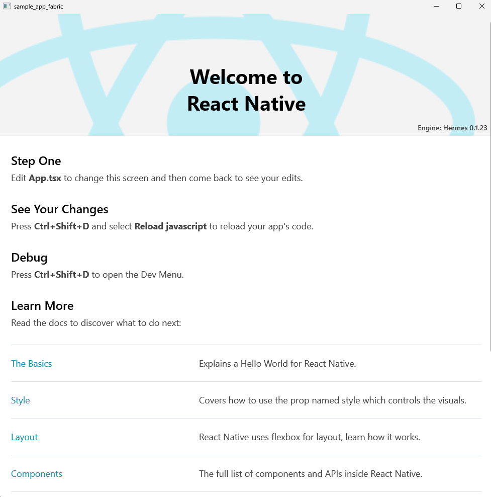

# Sample Fabric App

This package is used to verify a standalone New Architecture app. It consists of a vanilla application generated using the `cpp-app` template.

# Building the app

Before starting, make sure that you have the dev dependencies installed: https://microsoft.github.io/react-native-windows/docs/rnw-dependencies

Here are the steps in order to build the sample app :
```sh
yarn
yarn windows --logging
```

The app should launch successfully, and you should see the following:

