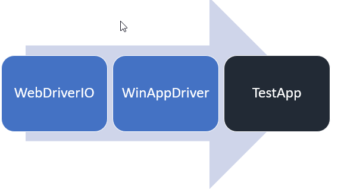
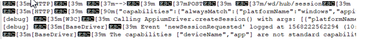

# Author and Run E2E Test for React Native Windows

# Overview

## Technical Decisions

### MSTest vs node test runner

A `node` test runner is the first choice since we started the investigation for E2E test. React Native apps are written in JavaScript and it&#39;s a good choose to select a JavaScript framework to author the test case. It would be more friendly to the community, so MSTest with C# is excluded in our option.

### WinAppDriver + WebDriverIO + Jasmine
There is not existing example we can follow to setup E2E testing on Windows for React Native, and I spent weeks to investigate, test and prototype for our E2E. Hereafter I explain what kind of decisions I made and why I made these decisions


#### Why WinAppDriver

1. Detox or Cavy require a significant, ongoing investment from us.
2. WinAppDriver is owned by us.

#### Why WebDriverIO

1. Be released more frequently.
2. [wdio-sync](https://github.com/webdriverio/webdriverio/tree/master/packages/wdio-sync) makes you write test case without using await.
3. wdio test runner makes the integration as quickly as possible.

Personally, I think WebDriverIO also introduced some difficulties:

1. Don&#39;t support Jest.
2. Another set of APIs different from selenium community.
3. wdio test runner simplified the steps for user to do the integration, but it also complexed the system. It have a lot of processes which makes debugging very hard.

#### Why Jasmine

1. wdio doesn&#39;t support Jest.
2. Mocha is used in my prototype, but it doesn&#39;t report test failure if exception is thrown in &#39;before&#39; function.
3. It&#39;s a piece of cake to switch from Mocha to Jasmine, and I finished this job in 10 minutes. See PR [3197](https://github.com/microsoft/react-native-windows/pull/3107)

## wdio Test Runner

WebdriverIO comes with its own test runner @wdio/cli. It simplified the steps for the integration, but it make it hard to be understood and be troubleshooted.

Below chart explains how different libraries are linked together when wdio command is launched. Appium or WinAppDriver are running in separate processes, and WebDriverIo talks to them by [W3C WebDriver protocol](https://w3c.github.io/webdriver/).


## WinAppDriver

WinAppDriver talks to TestApp by [UIA](https://docs.microsoft.com/en-us/windows/uwp/design/accessibility/accessibility-testing), and WinAppDriver implements part the W3C WebDriver protocol which allows WebDriver to talk to him. So WinAppDriver could talk directly with WebDriverIO, and whole test framework could be either with or without Appium.

There are two possible setup in dev environment based on with/without appium:
- Option 1

- Option 2


Option 1 is recommended and implemented by default. Appium and WinAppDriver are launched before spec is executed and they are killed after the spec is finished.

Option 2 is for advance user only. Each time we release a new WinAppDriver, we also need to update code on Appium. Before Appium has a new release, option 2 is the only way to verify the new features provides by WinAppDriver.

If `yarn install` is run as admin privilege, WinAppDriver would be installed automatically, otherwise you need to install WinAppDriver manually.

For the Azure pipeline, WinAppDriver is already installed on  [HostedVS2019](https://github.com/Microsoft/azure-pipelines-image-generation/blob/master/images/win/Vs2019-Server2019-Readme.md) and [HostedVS2017](https://github.com/Microsoft/azure-pipelines-image-generation/blob/master/images/win/Vs2017-Server2016-Readme.md)

## E2E project structure

E2E test app, test library and test cases are in packages/E2ETest/, and they are organized as below.

 ![](data:image/*;base64,iVBORw0KGgoAAAANSUhEUgAAAIIAAACMCAYAAACwCXGNAAAAAXNSR0IArs4c6QAAAARnQU1BAACxjwv8YQUAAAAJcEhZcwAADsMAAA7DAcdvqGQAAAneSURBVHhe7Z0/bGNZFcZPmJHYBQmQdqQFUYCQQxGFhoLCEaIdJ1qUKpTp7DJupkuDlG6apKBIummmSIEiocTaBSEQisWWC5aFEjML3bDLCg1QoAXFnHPufc6z8+65N4nt+NnfT7nv3D+285L3vXOfn7/cLPUZAgvPF3wECw6EABQIASgQAlAgBKBACECBEIACIQAFQgAKhAAUCAEoEAJQgh86/esPPyYdcl8uZg/N1SU8euvb9NXv/UzboJwEhfDPj96jr3zzJ1yT4St3xCWqCobjZ3/9Bb3zgzOug7ISnhpUHnERuHEOoNQEheCObYoIrqCDOcDOCAkicH3SBmUmnBFSRcB16KD8RN4+xkUAFcwHkakhRQRZDNNqLNHSki+NVtZLjaU1Omgd0JofWzvoJYyBSRCZGrhERNC/+q9W+//7N7eLqR329fX6/TOqH+3R9TFtU3OP6IWMXe4TNbcTx8C4saeGWCbg9pvXH9Gjx2/Rmz/9lNsBWg2fEdbpyHc5qrT/YocqUq3s0G69Td1LHWCsMTBujIygWy5hEUj/5//5B33tG9+nz9/8kfsK6HF6Xyc6kzO7f0n7Vd9/gx5ddHz1BtYYGAfGNUJcBBIl5T96/EWNhVx2qV1doWWp907puK29njYdn/p8r2N12qy5pj0Gxk04I+jGFoFG6c5iEbVntE9NWpapYbtLq0MZoUqr3W03bSw3afXskK6PtTUGxo2REbKNIQKO+rBBLKJCO+cuc/TPD+nw/Jx2dOJ3rDw7d2NcDkeOtDUGxoudESIicOMcBhGUFfMa4dOP36dP//IBx1/SJ69+RZ98/Gv62yspv6HXr35Lr//8Oz7+fY1Lj7/snwjKCP4IFijhjAAWCggBKBACUCAEoMC8ChSYV4Fi3EfINrYIcDNpPggKwR3bFBHAvDoP2BkhQQSuT9qpePeRfLAoH1FndfCghDNCqgi4fisd5Kns0Hl/+EOoYXKiARMl8vYxLoK7qwDMEpGpIUUEWTTQKSAzoV74TiF/xvfoYM09RkqjJWNibWtTc5n7BqZXMAkiUwOXiAji5lU+oGoscb6CF3Q84lv0tJ5Tc/VMHyPlsFajQzG7infxkvtgSJgo9tQQywTcjppXexfUqe7TM38cKzu7fHALWF6h6tE6bOsPhJERdMslLALpj5pXU9ELR8kYzp6GmWC6GNcIcRFIlDRumlcr36XVdpOe+wPbO9grnho8lZ1zutyvUucCmWGahDOCbmwRaJTuLBbCc/1ZnY7W3UXgNm0VTw2Dv31YouXmKu3qe8oabdZxsTgNgp81fPbhOr3zradcM0TAUSxrX//Oj1z84fvcB8qInREiInDjHAYRlJVgRvj772tOAwJXsro+3H352CdO3Gpefbf6c30MKB8wrwLFvo8AFgYIASgQAlAgBKDAvAoUmFeBEp4aVB5xEeBm0nwQFII7tikigHl1HrAzQoIIXJ+0J82s+RdT92fW9ruYcEZIFQHXp6IDMFEibx/jIoAK5oPI1JAigiyG8Knx4NpvMGRHyxlbpQzZDoKmV2boeQ3+LiH898+t4irfo3ew5p87jv0ZTf/GdFC436PGXe2cKpGpgUtEBCkrr+oqqt1Nfc3+WZ3azef+F8C/sJyxVVZY7axnv8DhsWHTq4wd05aYWvU1ifYKf+sZuVVcvUlmm19xfPuTSmC/bxh3/cOniD01xDIBt5NWXhUncuZerW1SnTqkTjQxtnJrsH5ifoVVy/Sqz/POJTmL1o+obS7LmlvFVb9/lbY2/F/VjGN/Ugnt9wwYd42MoFsuYRFI/9jMq7em7ldz9aU0dveC/Z4B465xjRAXgUT5YUzzqoUYWznBnmQ/OM+fe0f+jLRMr/559nRwB+66P7RMK9XcWtGtk9xYjsh+P6RxN5wRdGOLQKN0Z/HW1OhQ52GfKnX+zFZYtUyv7nmcY93zpIzlNLrr/lRoZ/d6bOlEzvsiAvtdaNydLjCvAsXOCBERuHEOg/iQ8BV5dpYNivW2EuSBeRUoMK8Cxb6PABYGCAEoEAJQIASgwLwKFJhXgRKeGlQecRHMxs0kcF+CQnDHNkUEMK/OA3ZGSBCB65M2KDPhjJAqAq7Plg7kM4eATQwEibx9jIsA2WA+iEwNKSLIYgh3hjYaYhb1nwYWGjj9mZwzmaaZSvOvL2Ojq7U+vDG0DESmBi4REaSaVzsrYhYVkwcfuKDxNGcyVQPHdqFxdNhUKmSvL+Mjq7XOgDG0DNhTQywTcDvVvDowi5rG05zJdNQ4yoe30FSq5F5/FKzomoSREXTLJSwC6b+beTXFeNqji46v3ocZMIaWAeMaIS4CiXIgb2VeNQ2cbTo+9f29Uzpu54yj/JxCU2kiWNHVJpwRdGOLQKN0ZzEJy3hapdWuO3OX9JogZxwNmkpHGVmtdQaMoWVghsyrcvW/RyuX1n90AZPCzggREbhxDoMIysoMmVeRER4SmFeBYt9HAAsDhAAUCAEoEAJQYF4FCsyrQAlPDSqPuAhwM2k+CArBHdsUEcC8Og/YGSFBBK5P2uPEuY70A0p1JsGDOGnCGSFVBFwfuw7yqJ8At50nTeTtY1wEk1UBmBaRqSFFBFksptW4aTQdpHlJ+9lgzpxqrmoaNLGC+xCZGrhERBAzr9Y263SUWYtaJ9Sp0sCF1Ds9JlpZloHEVU2HH3fTxAruij01xDIBt6PmVTGPdi5IjlXrpENbu1uiBG73SHSgptPUVU2jJlZwV4yMoFsuYRFIf9S8WtmgLT7DT3stOuls0UZN2l26FE8i10LmYzBdjGuEuAgkSoq2zasV2pAksL1Hna0Nbkm7QyfPu5IOvHXdWtU0xxhMrKCYcEbQjS0CjdKdxQAVUULbTwO+3TniaWKQDqxVTfPcxsQKbsMMmVfBQ2JnhIgI3DiHQQRlZYbMq+AhgXkVKPZ9BLAwQAhAgRCAAiEABeZVoMC8CpTw1KDyiIsAN5Pmg6AQ3LFNEQHMq/OAnRESROD6pH0P7mxQHXEvgTsTzgipIuD6fXUAg+rDE3n7GBfB/VUAZoHI1JAigiwWk2Zezff7+sH1IlihFViHTa5MwNiatg+LvUJrZGrgEhHBeMyro7Sp2d3UfbD+rf+wyXV4LG9sTdqHBV+h1Z4aYpmA22Mxr96gSvuZk3X03/qHTK6WsTVlHxZ8hVYjI+iWS1gE0l8K82rKPiz4Cq3GNUJcBBIljd7bvJqKZXI1ja3p+7CoK7SGM4JubBFolO4sBoibV1OxTK62sTW6Dwu+QivMq0CxM0JEBG6cwyCCsgLzKlBgXgWKfR8BLAwQAlAgBKBACEAJXiy+fPmSruTdwpX4Dfp0dSXvHK4GfRK/9Pbb9PTpU3ry5Il/FignRP8HsqNi3mzyPcsAAAAASUVORK5CYII=)

 - app – the RN app folder

 - reports – save the test reports

 - wdio – includes the page object libraries and test cases.

 - windows – the UWP native app

 - wdio.config.js – default parameters used by wdio test runner

## Bundle
Generally speaking, you don't need to care about it until you  setup Azure pipeline, or the app is ready for production.

In E2E project, bundle has two meanings:

1. Just like `react-native bundle` helps to generate an offline bundle file, then the app can run without the Metro Bundler.
2. A macro to build the native project. ReactUWPTestApp provides six bundle configurations: ReleaseBundle|x86, ReleaseBundle|x64, ReleaseBundle|ARM, DebugBundle|x86, DebugBundle|x64, DebugBundle|ARM

`Bundle` is very close to the production enviroment. 
Here are commands to support `Bundle` in the E2E test:

| Command | Description | Example |
| --- | --- | --- |
| bundle | Create a bundle file which then be packaged to the native app | yarn run bundle |
| buildbundleapp | build the native app with BUNDLE macro. <BR/> `--release` specify if it's a release version. <BR/> `--arch [string]` The build architecture (ARM, x86, x64) (default: &quot;x86&quot;) | `yarn run buildbundleapp` <BR/> `yarn run buildbundleapp --release` <BR/> `yarn run buildbundleapp --arch x64` |
| deploybundleapp | Deploy the built test app, you can pair it with `--release` and `--arch` | `yarn run deploybundleapp` <BR/>  `yarn run deploybundleapp --release` <BR/>  `yarn run deploybundleapp --arch x64` |
| e2ebundle | Make a bundle, Build and deploy the solution, and run the testing | `Yarn run e2ebundle` |

## Locators to find UI Element

No matter what JavaScript framework you choose for native app testing, you have to use one of the locators which is described in [mobile JSON wire protocol](https://github.com/SeleniumHQ/mobile-spec/blob/master/spec-draft.md#locator-strategies). Since locators are implemented significant different on iOS, Android and Windows, as below I only talk about the locators for Windows.

### [Locators WinAppDriver supports](https://github.com/microsoft/WinAppDriver/blob/master/Docs/AuthoringTestScripts.md#supported-locators-to-find-ui-elements)

 WinAppDriver provides rich API to help locate the UI element. If [testID](https://facebook.github.io/react-native/docs/picker-item#testid) is specified in React Native app for Windows, the locator strategy should choose `accessibility id`.

A unique `accessiblity id`/`testID` per Window is recommended for React Native Windows E2E testing when authoring the test app and test cases. To ease the maintain effort, all testIDs are defined in [Consts.ts](https://github.com/microsoft/react-native-windows/blob/master/packages/E2ETest/app/Consts.ts), then be imported by test app and test page objects or test cases.

| **Client API** | **Locator Strategy** | **Matched Attribute in inspect.exe** | **Example** |
| --- | --- | --- | --- |
| FindElementByAccessibilityId | accessibility id | AutomationId | AppNameTitle |
| FindElementByClassName | class name | ClassName | TextBlock |
| FindElementById | Id | RuntimeId (decimal) | 42.333896.3.1 |
| FindElementByName | Name | Name | Calculator |
| FindElementByTagName | tag name | LocalizedControlType (upper camel case) | Text |
| FindElementByXPath | Xpath | Any | //Button[0] |

### [Locators WebDriverIO supports](https://webdriver.io/docs/selectors.html#mobile-selectors)

| **Client API by Example** | **Locator Strategy** |
| --- | --- |
| $(&#39;~AppNameTitle&#39;) | accessibility id |
| $(&#39;TextBlock&#39;) | class name |

### [Locators selenium-appium supports](https://github.com/react-native-windows/selenium-appium/blob/master/src/by2.ts) for selenium-webdriver

| **Client API by Example** | **Locator Strategy** |
| --- | --- |
| By2.nativeAccessibilityId(&#39;AppNameTitle&#39;) | accessibility id |
| By2.nativeClassName(&#39;TextBlock&#39;) | class name |
| By2.nativeXpath(&#39;//Button[0]&#39;) | xpath |
| By2.nativeName(&#39;Calculator&#39;) | name |
| By2.nativeId(&#39;42.333896.3.1&#39;) | id |

## Timers

1. wdio.conf.js (see [https://webdriver.io/docs/timeouts.html](https://webdriver.io/docs/timeouts.html) )

```
// Default timeout for all waitFor\* commands.
waitforTimeout:10000,

jasmineNodeOpts: {
        defaultTimeoutInterval: 60000,
    }
```
2. Session Implicit Wait Timeout

A session has an associated session implicit wait timeout that specifies a time to wait for the implicit element location strategy when locating elements using the [findElement](https://webdriver.io/docs/api/webdriver.html#findelement) or [findElements](https://webdriver.io/docs/api/webdriver.html#findelements) commands. Unless stated otherwise it is zero milliseconds. You can set this timeout via:

```
browser.setTimeout({ 'implicit': 5000 });
```

3. waitForPageTimeout.

This timer is provided by BasePage object.

```
  // Default timeout for waitForPageLoaded command in PageObject
  privatewaitforPageTimeout: number = 10000;
```

You can override the setting in test case by passing a timeout parameter when call `waitForPageLoaded`, for example:

```
LoginPage.waitForPageLoaded(15000)
```

## wdio.conf.js

### Capabilities

capabilities are the configuration which appium/WinAppDriver used to identify the app and launch the app. Below configurations supports both with and without appium in the setup.

**&#39;appium:app&#39;** is used by appium when the setup is WebDriverIO <-> Appium <-> WinAppDriver,

**&#39;app&#39;** is used for directly connection between WebDriverIO <-> WinAppDriver.

```
  capabilities: [
  {
      maxInstances: 1,
      platformName: 'windows',
      'appium:deviceName': 'WindowsPC',
      'appium:app': 'ReactUWPTestApp_kc2bncckyf4ap!App',
      'deviceName': 'WindowsPC',
      'app': 'ReactUWPTestApp_kc2bncckyf4ap!App',
      'winAppDriver:experimental-w3c': true,
  },

```

### LogLevel
```
    logLevel: 'trace'
```
### Timeout

```
    // Default timeout for all waitFor* commands.
    waitforTimeout: 10000,
```

### appium service

Below configuration lets the framework launch/kill appium automatically during the testing, and logs are saved as `reports\appium.txt`.

```
    port: 4723,
    services: ['appium'],
    appium: {
        logPath: './reports/',
        args: {
            port: '4723',
        }
    },

```

But the log like below is not that readable because it has a lot of control characters which is used by terminal.

 

You could get nice output if you launch the appium by yourself:

1. Modify the configuration and remove `appium` from services
```
services: [],
```

2. Start appium by yourself
```
.\node\_modules\.bin\appium
```

### Test framework
```
framework: 'jasmine'
```

### Reports

```
reporters: ['dot', ['junit', { outputDir : '.\\reports' }]],
```

## PageObject Pattern

PageObject Pattern is recommended in the E2E test, and you can get more information from these links:

[https://github.com/SeleniumHQ/selenium/wiki/PageObjects](https://github.com/SeleniumHQ/selenium/wiki/PageObjects)

[https://webdriver.io/docs/pageobjects.html](https://webdriver.io/docs/pageobjects.html)

## Element Locator `By`

```
private get submitButton() {
    return By('Submit');
}

this.submitButton.click();
```

You can easily to use By(string) to locate a element which associated with testID in the app.

It's recommended to define a `get` for each locator like above.

# Run E2E test

## Procedures to setup and run E2E test

1. Install React Native command line interface using NPM:
```
npm install -g react-native-cli
```
2. Download and install WinAppDriver [WinAppDriver v1.1](https://github.com/microsoft/WinAppDriver/releases/download/v1.1/WindowsApplicationDriver.msi)
3. Install node packages, build JS

- C:\repo>`cd react-native-windows`
- C:\repo\react-native-windows>`yarn install`
- C:\repo\react-native-windows>`yarn build`

4. Build native app, deploy and launch e2e testing

- C:\repo\react-native-windows>`cd packages\E2ETest`
- C:\repo\react-native-windows\packages\E2ETest>`yarn run e2e`

Note: If it's the first time to launch the e2e testing, most likely some tests may fail because of:

1. Test is started before Metro Bundler is ready
2. Test is started before chrome is ready

In above situation, you don't need to call `yarn run e2e` again, just launch the test with below command.

C:\repo\react-native-windows\packages\E2ETest>`yarn run test`

## Procedures to only run E2E test

1. run all specs

packages\E2ETest>`yarn run test`

1.  Run one spec

packages\E2ETest>`yarn run testspec wdio\test\login.spec.ts`

## Commands help with build and test

| Command | Description | Example |
| --- | --- | --- |
| test | Run all specs | `yarn run test` |
| testspec | Run only one spec | `yarn run testspec wdio\test\login.spec.ts` |
| buildapp | build the native app with BUNDLE macro <BR/> `--release` specify if it's a release version <BR/>`--arch [string]` The build architecture (ARM, x86, x64) (default: &quot;x86&quot;) | `yarn run buildapp` <BR/> `yarn run buildapp --release` <BR/>`yarn run buildapp --arch x64` <BR/> `yarn run buildapp --arch x64 –release` |
| deployapp | Deploy the built test app, you can pair it with `--release` and `--arch` | `yarn run deployapp` <BR/> `yarn run deployapp --release` <BR/> `yarn run deployapp --arch x64` <BR/> `yarn run deployapp --arch x64 –release` |
| e2e | Build and deploy the solution (x86, debug), launch metro bundler and run all e2e specs | `yarn run e2e` |
| start | Launch the metro bundler | `yarn run start` |
| react-native run-windows | For details, see: react-native run-windows --help | `react-native run-windows --no-launch --no-packager --no-deploy --bundle` |

# Authoring E2E Test

## Create a new page for the test app

New test page should be in E2E/app/ or its subfolder.

Hooks are recommended to author the test page. (see [https://reactjs.org/docs/hooks-intro.html](https://reactjs.org/docs/hooks-intro.html) to learn more about Hooks)

```
// LoginTestPage.ts
export function LoginTestPage() {
  const [loginState, setLoginState] = useState('');
  …
  return (
    <View>
      <TextInput style={styles.input}
        placeholder='Email or Mobile Num'
        placeholderTextColor='rgba(225,225,225,0.7)'
        testID={USERNAME_ON_LOGIN}
        onChange={(text) => { setUserName(text.nativeEvent.text) }} />
   	…
 </View >);
}

```

## Add the new page to TestPages.ts

```
// TestPages.ts
const TestPages: ITestPage[] = [
…
  {
    testId: LOGIN_TESTPAGE,
    description: 'Login Test Page',
    content: LoginTestPage,
  },

```

## Put new testIDs in Consts.ts

```
//Consts.ts
export const USERNAME_ON_LOGIN = 'UserName';
```

## Create a Page Object to match with the page in test app

Page Objects should be put in E2ETest/wdio/pages and its subfolder.

```
// LoginPage.ts
class LoginPage extends BasePage {
  isPageLoaded() {
    return super.isPageLoaded() && this._userName.isDisplayed();
  }

  setLoginInfo(userName: string, password: string) {
    this._userName.setValue(userName);
    this._password.setValue(password);
  }

  submitForm() {
    this._submit.click();
  }

  private get _userName() {
    return By(USERNAME_ON_LOGIN);
  }

  private get _password() {
    return By(PASSWORD_ON_LOGIN);
  }

  private get _submit() {
    return By(SUBMIT_ON_LOGIN);
  }
}
export default new LoginPage();
```

Locator is defined in a `get` function and just returns By(testID), then you can use all element function like &#39;click&#39; which is defined in WebDriverIO.

Pay attention to the last line of the LoginPage, we always export a new instance of this object. It makes the test case more readable.

## Write a test spec to use the Page Object

```
// login.spec.ts
before(() => {
  HomePage.backToHomePage();
  HomePage.clickAndGotoLoginPage();
});

describe('LoginTest', () => {
  it('Login Success', () => {
    LoginPage.setLoginInfo('username', 'password');
    LoginPage.submitForm();
    assert.equal(LoginPage.getLoginResult(), 'Success');
  });
```

# Restrictions

1. If you made any change to native code, you must rebuild the native app and redeploy it.
2. The same session can&#39;t be shared by multiple specs. The framework always kills the old app and launches a new session.

# Known issue

1. For `yarn run e2e` or `yarn run e2ebundle`, the test continues even if one of steps like build failed. see [bug 3136](https://github.com/microsoft/react-native-windows/issues/3136) for more details
