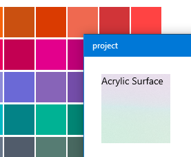

# Using Windows Brushes and Responding to Themes

## Overview
Windows supports two unique native styling/theming behaviors: one being the dark and light theme changes and the other being adaptive brushes and system colors. This article will show you how to set up your app to listen to theme changes and use the Windows brushes when and where you want.

### Setting up and handling theme changed events
In this example, we'll look at three things:

- How to set up your React Native app to be style and event sensitive to the system themes
- How to switch styles when a theme change has occurred
- Handling a theme changed event

#### Setting up your app to be sensitive to theme changes
First import the Platform API into your React Native app.

```JavaScript
import { AppTheme } from 'react-native-windows'
```

Create a local variable to use in a style conditional or to reference elsewhere, and then supply mounting functions to ensure that you are listening to the theme change events correctly.

```JavaScript
class MyAppClass extends Component {
  state = {
    currentTheme: AppTheme.currentTheme
  };

  componentDidMount() {
    AppTheme.addListener('appThemeChanged', this.onAppThemeChanged);
  };

  componentWillUnmount() {
    AppTheme.removeListener('appThemeChanged', this.onAppThemeChanged);
  };

  onAppThemeChanged = (event) => {
    const currentTheme = AppTheme.currentTheme;
    this.setState({currentTheme});
  };
}
```

#### Switching styles based on the app's theme
If the app author wants to switch the style of their component manually based on the system's theme (Dark or Light), they can do so with CSS-like style conditionals.

```JavaScript
 <Button title='click me' color={this.state.currentTheme === 'dark' ? 'grey' : 'orange'}/>
```

### Using Windows-defined theme brushes
These examples cover how to access and use the Windows system theme brushes and apply them in your styles.

#### Using theme brushes in a style

```css
const styles = StyleSheet.create({
  title: {
    fontSize: 19,
    fontWeight: 'bold',
    color: {windowsbrush: 'SystemControlPageTextBaseHighBrush'}
  },
});
```

#### Applying a system accent color variant
In Windows, there are algorithmically generated accent colors - dubbed Light or Dark 1, 2, and 3. This example covers what it would look like to apply that using the windowsbrush object.

```css
const styles = StyleSheet.create({
  title: {
    fontSize: 19,
    fontWeight: 'bold',
    color: {windowsbrush: 'SystemAccentColorLight3'}
  },
});
```

**Note:** That the system accent colors are `Color` objects at the native layer, whereas the other examples showed the use of theme brushes are `SolidColorBrush` objects. This means that the `SolidColoBrushes` will adapt automatically based on the Theme (Light, Dark or High Contrast), while the `Colors` will remain static.

### Using windowsbrush to access Reveal and Acrylic
Two awesome features about the native XAML platform are Reveal and Acrylic. These two Fluent Design visuals are only found in Windows 10 apps, but can easily be accessed through the same `windowsbrush` API we provide on the Javascript layer for other brushes.

#### Using System Acrylic
The `windowsbrush` api gives you access to all of the system acrylic brushes which can be accessed by resource name. Simply provide the resource brush name string in the component's style and it will be applied accordingly.



```css
const styles = StyleSheet.create({
  viewcomponent: {
    backgroundColor: {windowsbrush: 'SystemControlAcrylicWindowBrush'}
  },
});
```
#### Applying Reveal Highlight
Reveal can be applied to surfaces exactly the same way that Acrylic and other system brushes are.


```css
const styles = StyleSheet.create({
  viewcomponent: {
    backgroundColor: {windowsbrush: 'SystemControlBackgroundAccentRevealBorderBrush'}
  },
});
```
